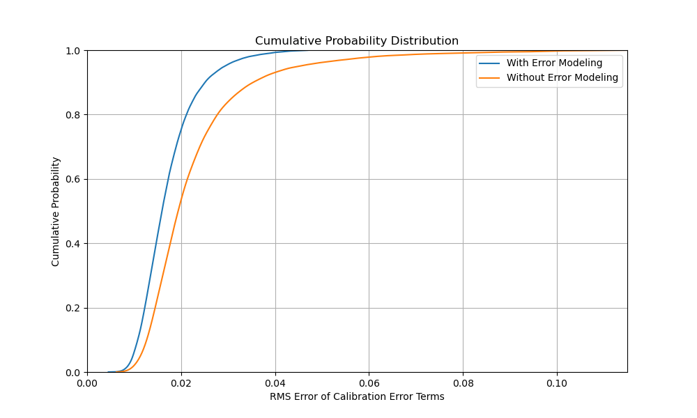

Calibration Error Modeling
==========================

Even with perfectly known calibration standards, there are two sources
of error that can lead to significant errors in calibration: measurement
noise and connection non-repeatability.  The library provides mechanisms
to model these errors and reduce their effects.  For example, the
``error-modeling.py`` script in the examples directory runs 10,000
simulated calibration runs of a 16-term error model with and without
error modeling, and compares the quality of the resulting error terms.

         of the error terms and unknown calibration parameters with and
         without error modeling.

Not only does error modeling move the CDF to the left in this example,
but maybe more importantly, it eliminates the long tail.  Thus, error
modeling gives both more accurate and more repeatable results.  The table
below gives another view of the same results.

.. table:: Comparison of Error Term RMS Error With and Without Error Modeling
   :widths: auto

   ============== ========= ========= ========= ========= ============
   Error Modeling   Mean    25 Pctile  Median   75 Pctile Success Rate
   ============== ========= ========= ========= ========= ============
         No       413.37891   0.01538   0.01948   0.02602       99.88%
         Yes        0.01772   0.01294   0.01598   0.02011       92.87%
   ============== ========= ========= ========= ========= ============

Without error modeling, a few calibration solutions are so extremely
wrong that the mean is pushed orders of magnitude over the median.
With error modeling, the extreme values are eliminated.

A price we pay with error modeling, however, is that significantly
more calibration attempts fail in the solve step and must be repeated.
In our example, the number of calibration attempts that fail increases
from 0.12% to over 7%.  Arguably, though, the runs that failed would
have produced lower quality results.

Libvna provides two mechanisms for error modeling: measurement error
modeling and connection non-repeatability modeling.  Either can be used
alone, or both together.  The next sections describe these mechanisms.

Measurement Error Modeling
--------------------------

Measurement error modeling is enabled through the `Solver.set_m_error`
method:

.. code-block:: python

   Solver.set_m_error(frequency_vector, noise_floor_vector, tracking_noise_vector=None)

where `frequency_vector` is a vector of frequency points in Hz,
`noise_floor_vector` is a vector of standard deviations of complex noise
detected by the VNA at each frequency when no signal from the DUT is
applied, and `tracking_noise_vector` is an optional vector of standard
deviations of noise detected by the VNA at each frequency, proportional
the amplitude of the received signal.  The two noise sources are assumed
to be Gaussian and independent.

Calling this method does several things.  First, it alters the calibration
equations such that the residual in each equation is equal to the error
in the measurement primarily associated with the equation.  It next
weights the equations such that all have equal expected residuals.  Then,
after the system of calibration equations has been solved, it runs a
chi-square test on the final residuals, where the null hypothesis is
that the magnitudes of the residuals are explained by the measurement
errors, and alternative is that they are not.  The `Solver.pvalue_limit`
attribute controls the threshold needed to reject the null.  By default,
the value is 0.001.

Without measurement error modeling, the solved error terms are made
to fit the calibration measurements in a least squares manner, but no
attempt is made to reject solutions with poor fit.  With error modeling,
calibration solutions in which the measurements are self-contradictory
and resulting solution has a poor fit to the measurements are rejected.

Note that enabling measurement error modeling always makes the system
non-linear, even if it wasn't before, and an iterative minimization
solution will be used.

Connection Non-repeatability Modeling
-------------------------------------

Each time a calibration standard or DUT is connected to the VNA, a certain
amount of error results from connection non-repeatability.  To model this,
the library provides a special type of unknown calibration parameter, the
`CorrelatedParameter`:

.. code-block:: python

   CorrelatedParameter parameter(calset, other, frequency_vector, sigma_vector)

where `calset` is the calibration set used for calibration, `other` is
another calibration parameter (possibly also unknown) to which this
parameter is correlated, `frequency_vector` is a vector of frequency
points, and `sigma_vector` is the square root of the covariance between
this parameter and the correlate at each frequency.

When a new calibration standard is connected, we can model each of its
parameters as a `CorrelatedParameter`, where the correlate is the known
or unknown true parameter of the standard, and the sigma value is the
expected error due to non-repeatability.

Some care is required in where to use correlated parameters.  Each
introduces a new variable and a new equation, which on the surface
sounds free, but introducing more variables that must be solved in a
non-linear system can make calibration more finicky.  Keep in mind that
many complex minimization problems are fractals, and even small errors
in initial conditions can result in converging to an unwanted solution.
Our advice is to make many measurements of your system and accurately
characterize your measurement errors, then before using measurement
error modeling, run simulations as in our example to validate that the
model you intend to use genuinely improves the results.
