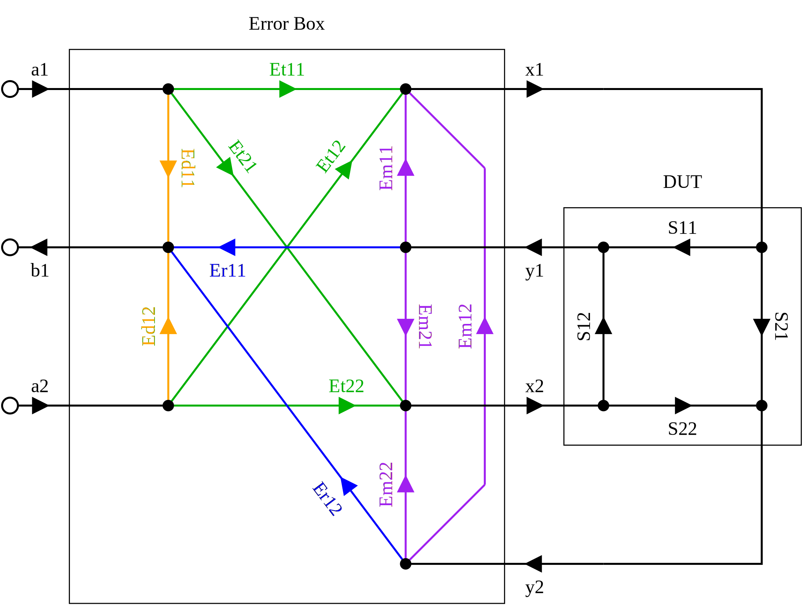

Calibration Model
=================

We can compensate for most errors in the VNA, directional couplers,
connectors, cables, test fixture and other components by modeling them as
an "error box" sitting between a perfect VNA and the device under test
(DUT).  During the calibration phase, we make measurements of known
standards and from them, calculate the error terms of the error box.
Later, when making measurements of a device under test, we mathematically
remove (de-embed) the error box to correct the measurements.

The **a1** and **a2** inputs into the error box are incident signals from
the VNA to the error box.  Ideally, all should be zero except for the
currently sourcing port.  The **b1** and **b2** outputs are the measured
reflected signals from the DUT.  More on this in the **a** and **b**
Matrix and References section toward the end.

The **x1**, **y1**, **x2**, and **y2** arrows define the "reference plane"
that delineates the VNA from the DUT.

The error terms (E terms) are simply the scattering parameters of the
error box.  Because the error box in this example is a 4-port device,
it has 16 error terms.

It's convenient to write the error terms as a 2x2 matrix of matrices:

.. table:: E Terms
   :widths: auto

   +----+----+
   | Ed | Er |
   +----+----+
   | Et | Em |
   +----+----+

Where the four sub-matrices, Ed, Er, Et and Em represent, directivity
error, reflection tracking error, transmission tracking error and port
match error, respectively.  The dimensions of the inner-matrices are
determined by the number of VNA ports.

The goal of calibration is to solve for the error terms using measurements
of known (and partially known) standards.  While the scattering parameter
form above is easy to understand, it's not the most convenient for for
solving the error terms.  Rather, it's much easier to solve for them
in scattering transfer (T) or inverse scattering transfer (U) form,
where the problem becomes a linear system of equations.  If E terms are
desired, then after solving for T or U error terms, we can convert them
back to E terms.

The next several sections describe the supported calibration types,
the error terms they provide, and the standards needed to solve them.

Calibration Types
-----------------

The module supports several types of error terms, capable of correcting
different errors.  In general, calibration types with more error terms
correct for more errors, but this comes at the cost of requiring more
calibration standards.  Also, while it may seem better to always use
calibrations that correct for more errors, correcting for errors you don't
actually have in your test setup may in fact turn noise measured during
calibration into correlated error in your measurements.  Therefore,
it's important to consider which errors are likely significant in a
given situation and choose the most appropriate calibration type.

For all supported types, the module solves for the error terms using
either scattering transfer (T) or inverse scattering transfer (U)
parameters, where the problem is a linear system of equations.
This provides wide flexibility in the choice of standards used, and
makes it always possible to to use more than the minimum required number
of standards.  If the resulting linear system is over-determined, the
module finds a least-squares solution using Q-R decomposition.

Calibration Dimensions
----------------------

The calibration solver class types takes *rows* and *columns* parameters
giving the dimensions of the calibration.  The *rows* parameter is the
number of VNA ports that detect signal; the *columns* parameter is the
number of VNA ports that transmit signal.  Ideally, all VNA ports both
transmit and receive signal, thus both parameters are simply the number of
VNA ports.  But many vector network analyzers measure only :math:`S_{11}`
and :math:`S_{21}`, or :math:`S_{11}` and :math:`S_{12}`.  The calibration
dimensions for these are 2x1 and 1x2, respectively.  When the VNA has more
than two ports, *rows* and *columns* must both be the number of ports.

The rest of this section describes each calibration type under each set
of dimensions.  It shows which errors are corrected and gives example
choices of calibration standards for each case.

Dimensions 1x1
--------------

In reflection only setups, the choice of calibration type doesn't
matter -- all types correct for the same three errors, Ed11, Er11
and Em11.  Et is a free variable which we set to 1.  The choice of E,
T or U error terms changes only the way the error terms are stored in
the VNA calibration file.  Mathematically, all are equivalent.

This calibration requires a minimum of three distinct reflect standards.
Typical choices are: short, open and match.

Dimensions 2x1
--------------

This section applies to vector network analyzers that measure
:math:`S_{11}` and :math:`S_{21}` only.

Type U8
^^^^^^^

.. image:: _static/E8_2x1.svg
   :alt: Diagram showing a 6-error term error box for a VNA that measures
         only :math:`S_{11}` and :math:`S_{21}`.

In the simplest calibration, the 2x1 setup has 6 error terms, one of
which is a free variable (typically Et11 is set to 1), giving effectively
5 error terms.  The module solves for the error terms using inverse
scattering transfer (U) parameters.  This calibration type is called
U8, the 8 being the number of error terms this type produces in a 2x2
configuration.

Typical choices of standards is: short, open, match and through.
It's possible, however, to perform this calibration using only three
standards, e.g. through, reflect and delay.

Types UE10, E12
^^^^^^^^^^^^^^^

         only :math:`S_{11}` and :math:`S_{21}`.

We can improve on the U8 calibration for free by adding the off-diagonal
directivity leakage terms to the model, in this case, the :math:`Ed_{21}`
term, bringing the effective number of error terms to 6.  Whenever we're
measuring a reflect standard on port 1, we can opportunistically measure
the leakage term into the second detector.  The module solves this
system using a hybrid of scattering (E) and inverse scattering transfer
(U) parameters.  The opportunistically measured leakage terms are first
subtracted out, then the system is solved using U parameters.

The E12 calibration type (the well-known 12-term model in 2x2) is
equivalent to UE10 in this setup, providing six error terms.  When E12
is used, the software solves the system using U parameters as above,
then converts the U terms to E terms before saving the calibration.
Thus in the 2x1 setup, UE10 and E12 are exactly the same except for the
format in which they save the error terms.

Like in U8, typical choice of standards is: short, open, match and
through.  Here also, it's possible to perform the calibration using only
three standards, e.g. through, reflect and delay.

Type U16
^^^^^^^^

         only :math:`S_{11}` and :math:`S_{21}`.

When using a test fixture with significant cross talk between the probes,
a stronger model that corrects for the additional errors is needed.
The U16 calibration type in the 2x1 setup provides 12 error terms,
one of which is a free variable, giving it effectively 11 error terms.
The software solves this calibration using inverse scattering (U)
parameters.

In 2x1 setups, at least six standards are required for calibration.
For example, a possible choice is: short-open, short-match, open-match,
open-short, match-short and through.  Why six?  We have to solve for 11
unknowns, and each standard gives us at most two measurements.  So at
minimum, we need 5 two-port standards and 1 single port standard to
reach 11.

Dimensions 1x2
--------------

This section applies to vector network analyzers that measure
:math:`S_{11}` and :math:`S_{12}` only.

When the calibration has more columns than rows, we cannot use U
parameters.  Instead, we use T parameters.  The T8, TE10 and T16 types
are duals of U8, UE10 and U16, respectively, correcting for the same
errors as their counterparts.

Type T8
^^^^^^^

         only :math:`S_{11}` and :math:`S_{12}`.

In the 2x1 setup, T8 calibration provides six error terms of which one is
a free variable, leaving effectively five terms.

Typical choice of standards is: short, open, match and through.  It's
possible, however, to perform this calibration using only three standards,
e.g. through, reflect and delay.

Type TE10
^^^^^^^^^

         only :math:`S_{11}` and :math:`S_{12}`.

The TE10 calibration type adds the off-diagonal directivity leakage term
:math:`Ed_{12}`, bringing the effective number of error terms to six.

Calibration standard requirements are the same as for U8, UE10 and T8.
Typical choice of standards is: short, open, match and through.  As in
the other cases, however, it's possible to perform this calibration using
only three standards, e.g. through, reflect and delay.

Type T16
^^^^^^^^

         only :math:`S_{11}` and :math:`S_{12}`.

The T16 calibration type adds additional leakage terms that correct for
cross talk between the probes in the text figure.

As in U16, in 1x2 dimension setups, at least six calibration standards
are required.  A possible choice is: short-open, short-match, open-match,
open=short, match-short and through.

Dimensions 2x2
--------------

In a 2x2 setup, each calibration type produces the number of error terms
in its name.  Though we have more error terms here than in the previous
sections, perhaps surprisingly, we can often perform the calibrations
with fewer standards because each calibration produces four measurements
instead of only one or two in the previous sections.  Another difference
is that the E12 calibration type becomes two completely independent 2x1
systems instead of 2x2.  This is useful in that it corrects for errors
introduced by the forward/reverse switch without an **a** matrix.

Types T8, U8
^^^^^^^^^^^^

In the 2x2 setup, T8 and its dual U8 produce 8 error terms, one of which
is a free variable, giving effectively seven error terms.

The 2x2 T8 and U8 calibrations require only three standards,
e.g. short-open, short-match and through.  At least one standard must be
reflect only and at least one must have a through component, e.g. through
or line.

Types TE10, UE10
^^^^^^^^^^^^^^^^

The TE10 and UE10 calibration types add the off-diagonal directivity
leakage terms, :math:`Ed_{12}` and :math:`Ed_{21}`, bringing the effective
number of standards up to nine.  Again, only three calibration standards
are needed.

Types E12, UE14
^^^^^^^^^^^^^^^

The E12 and UE14 calibration types are generalizations of the well-known
12-term error correction model, historically calibrated using SOLT or
OSLT standards.

In the forward direction, these types produce six error terms exactly
as in the 2x1 UE10/E12 calibrations above.

In the reverse direction, they produce another set of six error terms,
again as in the 2x1 UE10/E12 case, except with the ports swapped.
Together, these form the expected 12 error terms.

An advantage of using two independent 2x1 systems over a single 2x2
system is that it corrects for errors in the forward/reverse switch
without having to know the incident signal ("a" measurements) on the DUT,
because when the switch is changed, a completely separate set of error
terms is used.  This calibration can even correct for errors in a switch
that lies between the directional couplers and the DUT.

Types T16, U16
^^^^^^^^^^^^^^

The T16 and U16 calibration types produce 16 error terms, one of which is
a free variable, giving effectively 15 error terms. These calibrations
correct for all leakages including cross talk between the VNA probes in
the test fixture. Note, however, that they don't correct for errors in
the forward/reverse switch unless the incident signals on the DUT ('a'
measurements) are known.

At least five two-port standards are required for this calibration. A
typical choice is: short-open, short-match, open-match, open-short
and through.

Dimensions NxN
--------------

For more than 2 ports, the error boxes follow the same pattern as above
with 2 N ports, but only square dimensions are supported.  The following
table shows the number of error terms for each calibration type, given
*p* VNA ports:

.. table:: Effective Number of Error Terms for p Ports
   :widths: auto

   +------------+-----------------+----------------+------------------+
   | Type       | Linear Terms    | Off-Diagonal   | Total Terms      |
   +============+=================+================+==================+
   | T8, U8     | :math:`4p-1`    | 0              | :math:`4p-1`     |
   +------------+-----------------+----------------+------------------+
   | TE10, UE10 | :math:`4p-1`    | :math:`p(p-1)` | :math:`p^2+3p-1` |
   +------------+-----------------+----------------+------------------+
   | E12, UE14  | :math:`p(2p+1)` | :math:`p(p-1)` | :math:`3p^2`     |
   +------------+-----------------+----------------+------------------+
   | T16, U16   | :math:`4p^2-1`  | 0              | :math:`4 p^2 - 1`|
   +------------+-----------------+----------------+------------------+

To get a sense of the number of calibration standards needed, in
all but T16 and U16: a single reflect contributes one equation to the
linear system.  A double reflect contributes two equations.  Through and
line standards contribute four equations.  Multi-port standards with
through components between all ports contribute number of standards
ports squared.  Multi-port standards made of isolated groups contribute
the sum of the equations from each group.  Off-diagonal leakage terms
outside of the linear system are measured opportunistically whenever
there is no connection between the driving port and another port.
If for each driving port, there is a case where all ports are either
connected to reflect standards or are are not connected, they provide
all :math:`p(p-1)` off-diagonal leakage terms.

In T16 and U16, all standards contribute number of VNA ports times
number of standards ports equations to the linear system.

The number of equations in the linear system must be at least that of
the number of linear equation error terms plus the number of unknown
parameters.  Note that not all equations produced by a given choice of
standards are linearly independent, thus more standards may be needed
than the minimum calculated above.

The **a** and **b** Inputs and VNA Reference Channel
----------------------------------------------------

The :func:`libvna.cal.Solver.add*` functions and the
:func:`libvna.cal.Calibration.apply` function take a **b** matrix and
optional **a** matrix as inputs.  This section describes these matrices.

The figure above shows an example of a two-port VNA that measures
full S-parameters.  The b1 and b2 signals are reflected and through
signals coming back from the device under test.  The **b** matrix for
this configuration is formed from:

.. math::

   b = \left[ \begin{array}{cc}
   b_{11} & b_{12} \\
   b_{21} & b_{22} \\
   \end{array} \right]

where :math:`b_{11}` and :math:`b_{21}` are the b1 and b2 measurements,
respectively, when the VNA is sourcing signal on port 1, and
:math:`b_{12}` and :math:`b_{22}` are the b1 and b2 measurements,
respectively, when the VNA is sourcing signal on port 2.  In this example,
we do not supply an **a** matrix.

Some vector network analyzers have a reference channel that measures the
amplitude and phase of the source signal so that any variations in the
source can be divided out of the measurements.  These reference values
can be given in the **a** matrix.  For all calibration types except for
E12 and UE14, the **a** matrix has dimensions *columns* x *columns*,
and the reference values can be given on the major diagonal:

.. math::

   a = \left[ \begin{array}{cc}
   r_1 & 0 \\
   0 & r_2 \\
   \end{array} \right]

where :math:`r_1` is the reference measurement when the VNA is sourcing
signal on port 1 and :math:`r_2` is the reference measurement when the
VNA is sourcing signal on port 2.  The same pattern applies for other
than two ports.  This causes each reference measurement to be divided
out of the corresponding column of the **b** matrix.

For calibration types E12 and UE14, however, the **a** matrix is 1 x
*columns* row vector, and the reference values can simply be placed into
the vector:

.. math::

   a = \left[ \begin{array}{cc}
   r_1 & r_2 \\
   \end{array} \right]

The reason the E12 and UE14 calibration types are different is that these
types use a separate n x 1 calibration for each sourcing port (column),
and the **a** matrix in this case represents a vector of 1x1 reference
matrices.

Still more advanced VNA's measure the amplitude and phase of the
signal leaving all ports simultaneously.  Not only does this compensate
for variations in the source signal, but it also corrects for errors
introduced by the switch, including RF leaking across the switch and being
sourced from other than the intended channel, and signal received from
the DUT hitting an impedance discontinuity in the switch and reflecting
back out of the VNA to the DUT.  In this configuration, for all calibration
types except for E12 and UE14, **a** is a full matrix.

.. math::

   a = \left[ \begin{array}{cc}
   a_{11} & a_{12} \\
   a_{21} & a_{22} \\
   \end{array} \right]

where :math:`a_{11}` and :math:`a_{21}` are the signals detected on a1 and
a2, respectively, when the VNA is sourcing on port 1, and :math:`a_{12}`
and :math:`a_{22}` are the signals detected on a1 and a2, respectively,
when the VNA is sourcing on port 2.  The same pattern applies for other
than two ports.

The libvna.cal module removes the effect of the **a** matrix by dividing
on the right:

.. math::
   m = b\, a^{-1}

As above, in the E12 and UE14 calibration types, **a** is a row vector
of reference values.  In this configuration, it can hold only the major
diagonal, e.g. :math:`a_{11}` and :math:`a_{22}`.  Nothing is really
lost, though because the E12 and UE14 calibration types compensate for
the same switch errors as the full matrix above by incorporating them
into the separate calibrations for each switch position.

Important: the **a** matrix, if used, must be used consistently between
calibration and applying the calibration to a device under test.
